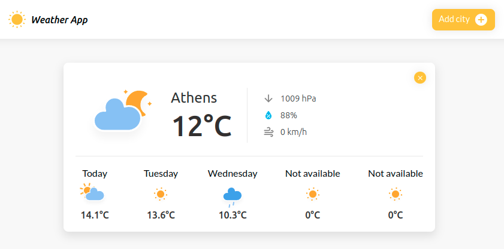

<div id="top"></div>

<h3 align="center">Weather App</h3>

  <p align="center">
    A weather forecast app!
    <br />
    <a href="https://github.com/ikolokotronis/WeatherApp"><strong>Explore the docs »</strong></a>
    <br />
    <br />
    <a href="#demo">View Demo</a>
    ·
    <a href="https://github.com/ikolokotronis/WeatherApp/issues">Report Bug</a>
    ·
    <a href="https://github.com/ikolokotronis/WeatherApp/issues">Request Feature</a>
  </p>
</div>


<!-- TABLE OF CONTENTS -->
<details>
  <summary>Table of Contents</summary>
  <ol>
    <li>
      <a href="#about-the-project">About The Project</a>
    </li>
    <li>
      <a href="#getting-started">Getting Started</a>
      <ul>
        <li><a href="#installation">Installation</a></li>
      </ul>
    </li>
    <li><a href="#roadmap">Roadmap</a></li>
    <li><a href="#contributing">Contributing</a></li>
    <li><a href="#contact">Contact</a></li>
  </ol>
</details>


<!-- ABOUT THE PROJECT -->
## About The Project

A JS application that fetches information from an API about the current weather conditions, as well as about the weather conditions in the following days. I used a free api version that allows to retrieve information only for the current day and the next two, in which case I couldn't fetch data about the whole week.  
That's why you will see "Not available" instead of the last four days, but the app can be upgraded easily if you have access to a key that allows that.  
If you wan't to upgrade the application and don't know how, please <a href="#contact">contact</a> me.

<p align="right">(<a href="#top">back to top</a>)</p>


## Demo

<i>Not available yet</i>

<p align="right">(<a href="#top">back to top</a>)</p>

## Screenshot



<!-- GETTING STARTED -->
## Getting Started

To get a local copy up and running follow these simple example steps

### Installation

1. Get a free API Key at [https://www.weatherapi.com/](https://www.weatherapi.com/)
2. Clone the repo
   ```sh
   git clone https://github.com/ikolokotronis/WeatherApp.git
   ```
3. Enter your API in the first line of `app.js`
   ```js
   const apiKey = 'ENTER YOUR API';
   ```
4. Open index.html in your browser

<p align="right">(<a href="#top">back to top</a>)</p>


<!-- ROADMAP -->
## Roadmap

- [ ] Add hourly forecast


<p align="right">(<a href="#top">back to top</a>)</p>


<!-- CONTRIBUTING -->
## Contributing

Any contributions you make are appreciated.

If you have a suggestion that would make this better, please follow these instructions:

1. Fork the Project
2. Create your Feature Branch (`git checkout -b branch_name/some_text`)
3. Commit your Changes (`git commit -m 'Commit name'`)
4. Push to the Branch (`git push origin branch_name/some_text`)
5. Open a Pull Request

<p align="right">(<a href="#top">back to top</a>)</p>


<!-- CONTACT -->

## Contact
Ioannis Kolokotronis - ioanniskolokotronis1@gmail.com

Project Link: [https://github.com/ikolokotronis/WeatherApp](https://github.com/ikolokotronis/WeatherApp)

<p align="right">(<a href="#top">back to top</a>)</p>
