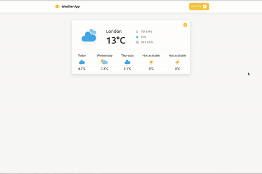

<div id="top"></div>

<h3 align="center">Weather App</h3>

  <p align="center">
    <a href="#demo">View Demo</a>
  </p>
</div>


<!-- TABLE OF CONTENTS -->
<details>
  <summary>Table of Contents</summary>
  <ol>
    <li>
      <a href="#about-the-project">About The Project</a>
    </li>
    <li>
      <a href="#key-functionalities">Key Functionalities</a>
    </li>
    <li>
      <a href="#getting-started">Getting Started</a>
      <ul>
        <li><a href="#installation">Installation</a></li>
      </ul>
    </li>
    <li><a href="#contact">Contact</a></li>
  </ol>
</details>


<!-- ABOUT THE PROJECT -->
## About The Project

A JS application that fetches information from a weather API  about current and future weather conditions.   


### Key Functionalities
<ul>
  <li>Landing page displays information about the weather condition in your current location (based on IP)</li>
  <li>Search for any city in the world easily</li>
  <li>App displays information about: </li>
  <ul>
    <li>Temperature in celcius</li>
    <li>Humidity</li>
    <li>Pressure</li>
    <li>Wind speed</li>
  </ul>
</ul>


## Demo



## Screenshot


<!-- GETTING STARTED -->
## Getting Started

To get a local copy up and running follow these simple steps

### Installation

1. Get a free API Key at [https://www.weatherapi.com/](https://www.weatherapi.com/)
2. Clone the repo
   ```sh
   git clone https://github.com/ikolokotronis/WeatherApp.git
   ```
3. Enter your API key in the first line of `app.js`
   ```js
   const apiKey = 'ENTER YOUR API KEY';
   ```
4. Open index.html in your browser


## Note
I used a free api version coming with some limitations in which case I couldn't fetch data for more than a couple days, but the app can be easily upgraded with a key from [weather api](https://www.weatherapi.com/) that allows that.

<!-- CONTACT -->

## Contact
Ioannis Kolokotronis - ioanniskolokotronis1@gmail.com

Project Link: [https://github.com/ikolokotronis/WeatherApp](https://github.com/ikolokotronis/weatherApp)

<p align="right">(<a href="#top">back to top</a>)</p>
